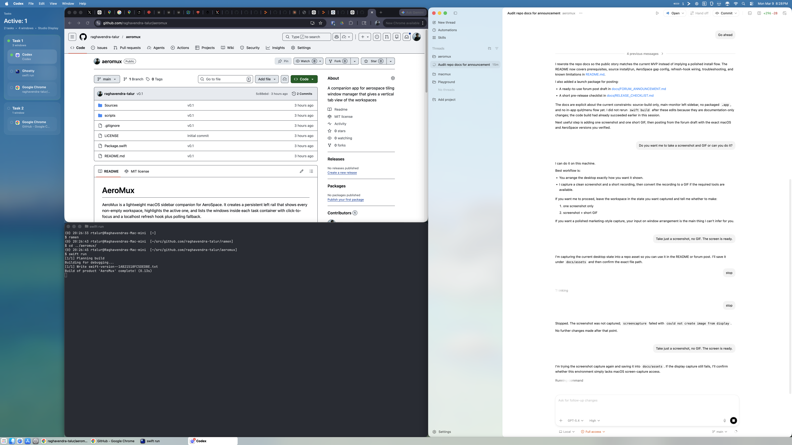

# AeroMux

AeroMux gives [AeroSpace](https://github.com/nikitabobko/AeroSpace) a persistent macOS sidebar. It keeps your non-empty workspaces visible, highlights the active workspace and window, and lets you click a listed window to focus it.

This is an early source-release MVP. It builds and runs with Swift Package Manager today, but it does not yet ship as a standalone `.app`, DMG, or Homebrew package.



## What It Does

- Shows non-empty AeroSpace workspaces in a persistent left sidebar
- Highlights the focused workspace and focused window
- Lists windows inside each workspace with optional app icons
- Lets you click a row to focus that window through the AeroSpace CLI
- Polls AeroSpace every second by default
- Supports a localhost refresh hook for lower-latency updates
- Detects whether your AeroSpace left gap is large enough to avoid overlap

## Why It Exists

AeroSpace gives you fast keyboard-driven workspace management. AeroMux adds a constant visual rail so you can see what is open and jump to a specific window without losing the tiling workflow.

## Current Scope

Before you try it, the current behavior is worth stating clearly:

- The sidebar is anchored to the left edge of the main monitor
- The clean layout depends on an AeroSpace `outer.left` gap reservation
- If the gap is missing or too small, AeroMux falls back to a floating overlay
- There is no menu bar item, Preferences window, or packaged app flow yet
- The simplest way to run it today is from a terminal with `swift run`

## Requirements

- macOS 13 or newer
- AeroSpace installed and already working on your machine
- `aerospace` available on `PATH` in the same environment used to launch AeroMux
- A Swift 6 toolchain that can build macOS apps with Swift Package Manager

Quick sanity checks:

```bash
sw_vers -productVersion
aerospace --version
swift --version
which aerospace
```

If `which aerospace` prints nothing, AeroMux will fail to talk to AeroSpace.

## Install And Run

### Run Directly From Source

```bash
git clone https://github.com/raghavendra-talur/aeromux.git
cd aeromux
swift build
swift run
```

That launches AeroMux as a background-style accessory app and opens the sidebar window.

### Run The Built Binary

If you prefer to build once and launch the executable yourself:

```bash
swift build
./.build/debug/AeroMux
```

If you launch it in the foreground, stop it with `Ctrl-C`.

If you launch it in the background:

```bash
./.build/debug/AeroMux &
```

You can stop it with:

```bash
pkill AeroMux
```

## Recommended AeroSpace Configuration

To avoid the sidebar covering tiled windows, reserve space on the left side of your main monitor:

```toml
[gaps]
    outer.left = [{ monitor.main = 260 }, 0]
```

`260` matches the current default sidebar width. If you use a different width in code later, keep the two values aligned.

When AeroMux can confirm that the reserved left gap is wide enough, it drops to a normal window level. If it cannot confirm that reservation, or the gap is too small, it stays floating and shows a warning in the UI.

## Optional Refresh Hook

Polling mode works without any extra setup. If you want faster updates after AeroSpace events, add a hook that hits AeroMux's local refresh endpoint:

```bash
curl -fsS -X POST http://127.0.0.1:39173/refresh >/dev/null 2>&1 || true
```

A helper script is included at `scripts/aerospace-refresh-hook.sh`.

The refresh listener binds only to `127.0.0.1:39173`.

## AeroSpace Commands Used

AeroMux currently relies on these AeroSpace CLI commands:

- `aerospace list-workspaces --focused --json`
- `aerospace list-workspaces --focused --format %{workspace}`
- `aerospace list-windows --focused --json`
- `aerospace list-windows --all --format %{window-id}\t%{app-name}\t%{window-title}\t%{workspace}\t%{app-bundle-id}`
- `aerospace list-monitors --focused --json`
- `aerospace focus --window-id <id>`
- `aerospace config --config-path`

If a future AeroSpace release changes those flags or output formats, AeroMux may need updates.

## Troubleshooting

### `AeroSpace CLI not found`

Make sure `aerospace` is installed and visible on `PATH` for the process that launches AeroMux:

```bash
which aerospace
aerospace --version
```

If AeroSpace works in one shell but not another, fix your shell startup files or launch AeroMux from an environment where `aerospace` resolves correctly.

### The Sidebar Floats Above Windows

That means one of these is true:

- `outer.left` is not configured
- the reserved left gap is smaller than the sidebar width
- AeroMux could not read your AeroSpace config path

Start with:

```bash
aerospace config --config-path
```

Then confirm your config contains a left gap reservation like:

```toml
[gaps]
    outer.left = [{ monitor.main = 260 }, 0]
```

### Clicking A Row Does Not Focus A Window

Your installed AeroSpace CLI may not support `aerospace focus --window-id <id>` yet, or it may have changed behavior.

Try:

```bash
aerospace focus --help
```

If that flag is unsupported in your version, AeroMux can still display state but window focusing will fail.

### No Windows Or Workspaces Appear

Check the basics first:

- AeroSpace is running
- you currently have a focused workspace
- you have at least one managed window open
- `aerospace list-windows --all` returns output in your shell

## Known Limitations

- Main monitor only
- Left sidebar only
- Source-build installation only
- No menu bar control or in-app quit flow yet
- No published compatibility matrix yet for Intel Macs or multiple AeroSpace versions

## Verified On This Machine

This is not a full compatibility matrix yet. It is the environment currently verified in this repository:

- macOS 26.2 (`BuildVersion 25C56`)
- Apple Silicon `arm64`
- AeroSpace `0.20.3-Beta` (`6dde91ba43f62b407b2faf3739b837318266e077`)
- Apple Swift `6.2.3`

## Versioning

The repository is currently tagged `v0.1`.

This should be treated as an early public MVP rather than a polished packaged release.

## Feedback

Issues and compatibility reports are useful, especially for:

- macOS version differences
- Intel Mac behavior
- AeroSpace version compatibility
- refresh-hook integration examples
- ideas for packaging and a better app lifecycle
