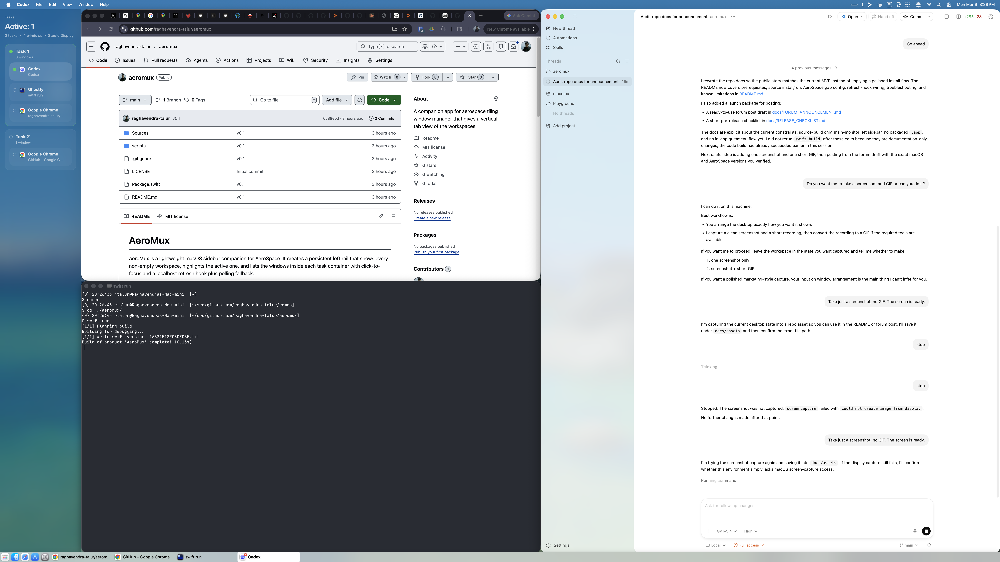

# AeroMux

AeroMux is a macOS menu bar companion for [AeroSpace](https://github.com/nikitabobko/AeroSpace). It adds a persistent left sidebar so you can see your non-empty workspaces, spot the focused window, and jump directly to a window without leaving your tiling workflow.



## Highlights

- Shows non-empty AeroSpace workspaces in a persistent sidebar
- Highlights the focused workspace and focused window
- Lists windows by app name and title
- Lets you click a window row to focus it through the AeroSpace CLI
- Supports standard and floating window modes
- Lets you change sidebar width, compact mode, workspace ordering, launch-at-login, and keyboard shortcuts from the menu bar
- Supports local workspace titles and descriptions
- Polls AeroSpace every second by default, with an optional localhost refresh hook for lower-latency updates

## Window Modes

AeroMux starts in **standard** window mode.

Standard mode is the integrated layout. AeroMux expects AeroSpace to reserve a left gap at least as wide as the sidebar. When the gap is configured correctly, the sidebar uses a normal window level and tiled windows stay out of its way.

Floating mode is the zero-config layout. AeroMux keeps the sidebar floating above normal windows, AeroSpace leaves it alone instead of tiling it, and sidebar width no longer depends on `outer.left`. This is simpler to try, but it can cover tiled windows.

You can switch modes from the menu bar:

```text
AeroMux menu bar icon -> Window Mode -> Standard
AeroMux menu bar icon -> Window Mode -> Floating
```

## Recommended AeroSpace Setup

For the best standard-mode experience, reserve a left gap on your main monitor:

```toml
[gaps]
    outer.left = [{ monitor.main = 260 }, 0]
```

`260` is AeroMux's default sidebar width. If you change the sidebar width from the menu bar or in `settings.json`, keep the standard-mode `outer.left` value at least that large.

If AeroMux cannot confirm a large enough gap in standard mode, it falls back to a floating overlay and shows an integration warning in the sidebar.

## Requirements

- macOS 13 or newer
- AeroSpace installed and already working
- `aerospace` available on `PATH` in the environment that launches AeroMux
- A Swift 6 toolchain if you build from source

Quick checks:

```bash
sw_vers -productVersion
aerospace --version
which aerospace
swift --version
```

If `which aerospace` prints nothing, AeroMux will not be able to read or focus AeroSpace windows from that launch environment.

## Install

### Download The DMG

The preferred install path is the latest DMG from [GitHub Releases](https://github.com/raghavendra-talur/aeromux/releases).

Release builds are Developer ID-signed and notarized by Apple. Open the DMG, drag `AeroMux.app` into `Applications`, and launch it.

### Build From Source

```bash
git clone https://github.com/raghavendra-talur/aeromux.git
cd aeromux
swift build
swift run
```

AeroMux launches as a background-style accessory app and opens the sidebar window.

To build and run the executable yourself:

```bash
swift build
./.build/debug/AeroMux
```

Stop a foreground run with `Ctrl-C`.

To launch in the background:

```bash
./.build/debug/AeroMux &
```

Stop a background run with:

```bash
pkill AeroMux
```

## Menu Bar Controls

The AeroMux menu bar item is the main control surface:

- **Show Sidebar** / **Hide Sidebar** toggles the sidebar window
- **Sidebar Width** sets a whole-number width from `100` to `600` pixels
- **Window Mode** switches between standard and floating behavior
- **Pin Active Workspace First** moves the focused workspace to the top
- **Compact Mode** uses a denser sidebar layout
- **Launch at Login** asks macOS to start AeroMux automatically
- **Keyboard Shortcuts...** opens the shortcut recorder
- **Refresh Now** asks AeroMux to reread AeroSpace state immediately
- **Quit AeroMux** exits the app

## Keyboard Shortcut

There is no default global shortcut. To set one:

1. Click the AeroMux menu bar icon.
2. Choose **Keyboard Shortcuts...**.
3. In the **AeroMux Shortcuts** window, record a shortcut for **Toggle Sidebar**.

Once set, the shortcut toggles the sidebar from any app. The current shortcut also appears next to **Show Sidebar** or **Hide Sidebar** in the menu bar.

## Workspace Names

Each workspace card has an edit button. Use it to set a local title and optional description for that AeroSpace workspace.

Custom titles and descriptions are stored in `workspaces.json`. AeroMux still keeps the original AeroSpace workspace name, and shows it as `Workspace <name>` when a custom title is present.

## Configuration Files

AeroMux stores user-editable files under:

```bash
~/.config/aeromux
```

If `XDG_CONFIG_HOME` is set, AeroMux uses:

```bash
$XDG_CONFIG_HOME/aeromux
```

### `settings.json`

Created automatically on first launch:

```json
{
  "compactMode": false,
  "launchAtLogin": false,
  "pinActiveWorkspaceFirst": false,
  "sidebarWidth": 260,
  "windowMode": "standard"
}
```

Keys:

- `sidebarWidth`: sidebar width in pixels, clamped to whole numbers from `100` to `600`
- `windowMode`: `standard` or `floating`
- `compactMode`: denser sidebar text and spacing
- `pinActiveWorkspaceFirst`: move the focused workspace to the top
- `launchAtLogin`: register or unregister AeroMux with macOS login items

Changes made through the menu bar apply immediately. Manual file edits are picked up the next time AeroMux launches.

### `workspaces.json`

Created automatically as AeroMux discovers workspaces:

```json
{
  "workspaces": [
    {
      "workspace": "1",
      "title": "1",
      "description": null
    }
  ]
}
```

Keys:

- `workspace`: exact AeroSpace workspace name
- `title`: label shown in the sidebar instead of `Task <workspace>`
- `description`: optional detail line under the title

## Refresh Hook

Polling works without extra setup. For faster updates after AeroSpace events, call AeroMux's local refresh endpoint:

```bash
curl -fsS -X POST http://127.0.0.1:39173/refresh >/dev/null 2>&1 || true
```

A helper script is included at `scripts/aerospace-refresh-hook.sh`.

The listener binds only to `127.0.0.1:39173`.

## AeroSpace Commands Used

AeroMux currently calls:

- `aerospace list-workspaces --focused --json`
- `aerospace list-workspaces --focused --format %{workspace}`
- `aerospace list-windows --focused --json`
- `aerospace list-windows --all --format %{window-id}\t%{app-name}\t%{window-title}\t%{workspace}\t%{app-bundle-id}`
- `aerospace list-monitors --focused --json`
- `aerospace focus --window-id <id>`
- `aerospace config --config-path`

If a future AeroSpace release changes those flags or output formats, AeroMux may need updates.

## Troubleshooting

### `AeroSpace CLI not found`

Make sure `aerospace` is installed and visible on `PATH` for the process that launches AeroMux:

```bash
which aerospace
aerospace --version
```

If AeroSpace works in one shell but not another, fix your shell startup files or launch AeroMux from an environment where `aerospace` resolves correctly.

### The Sidebar Floats Above Windows

If window mode is set to floating, this is expected.

If window mode is set to standard, one of these is likely true:

- `outer.left` is not configured
- the reserved left gap is smaller than the sidebar width
- AeroMux could not read your AeroSpace config path

Start with:

```bash
aerospace config --config-path
```

Then confirm your config contains a left gap reservation like:

```toml
[gaps]
    outer.left = [{ monitor.main = 260 }, 0]
```

If you changed `sidebarWidth`, use that number instead of `260`.

### Clicking A Row Does Not Focus A Window

Your installed AeroSpace CLI may not support `aerospace focus --window-id <id>` yet, or the flag may have changed.

Try:

```bash
aerospace focus --help
```

If that flag is unsupported, AeroMux can still display state but window focusing will fail.

### No Windows Or Workspaces Appear

Check that:

- AeroSpace is running
- a workspace is focused
- at least one managed window is open
- `aerospace list-windows --all` returns output in your shell

## Current Limitations

- Main monitor only
- Left sidebar only
- No Preferences window yet
- No published compatibility matrix yet for Intel Macs or multiple AeroSpace versions

## Verified Environment

This is not a full compatibility matrix. It is the environment currently verified in this repository:

- macOS 26.2 (`BuildVersion 25C56`)
- Apple Silicon `arm64`
- AeroSpace `0.20.3-Beta` (`6dde91ba43f62b407b2faf3739b837318266e077`)
- Apple Swift `6.2.3`

## Development

Useful local commands:

```bash
swift build
swift test
make app
```

`make app` creates a packaged app at:

```bash
dist/AeroMux.app
```

General contributor workflow is documented in [docs/DEVELOPMENT.md](docs/DEVELOPMENT.md). Release packaging is documented in [docs/RELEASING.md](docs/RELEASING.md).

## Feedback

Issues and compatibility reports are useful, especially for:

- macOS version differences
- Intel Mac behavior
- AeroSpace version compatibility
- refresh-hook integration examples
- packaging and app lifecycle ideas
